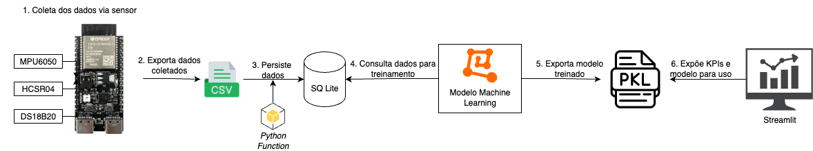
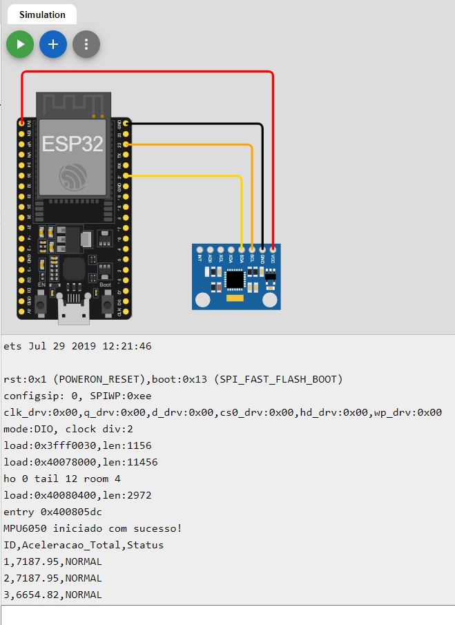
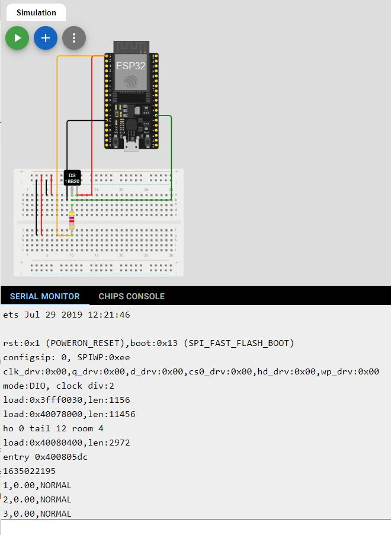
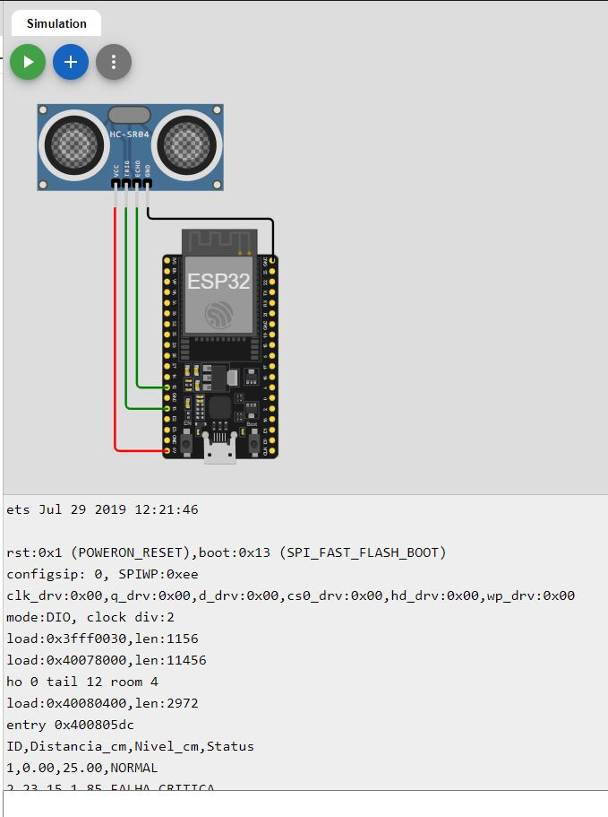
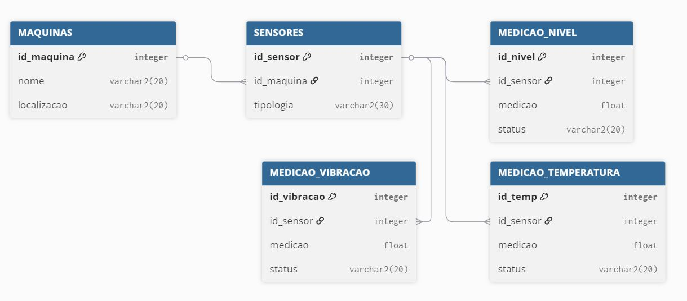
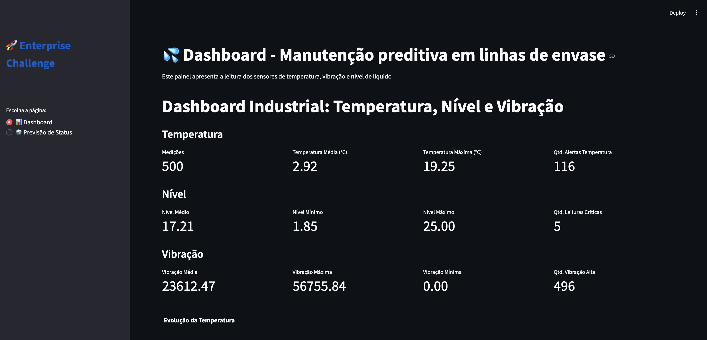
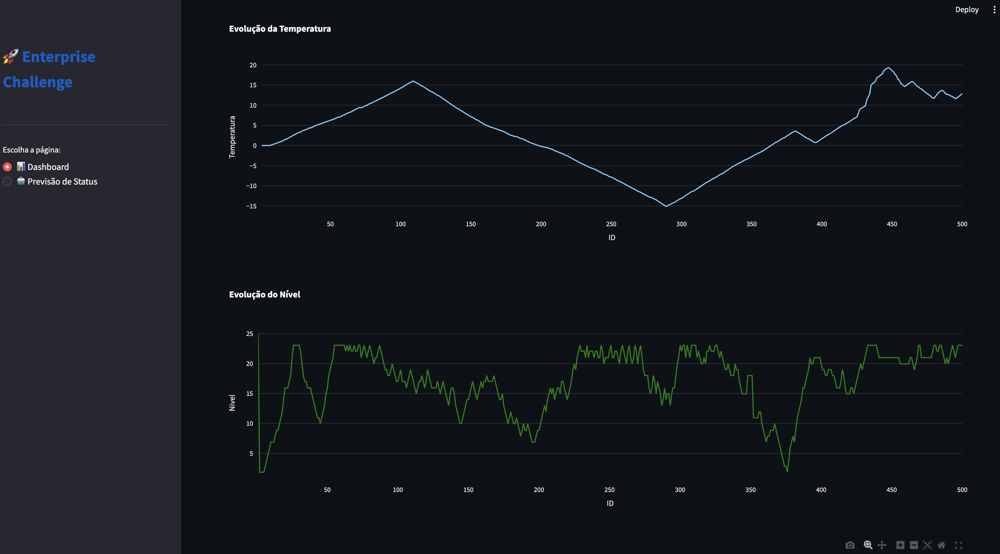
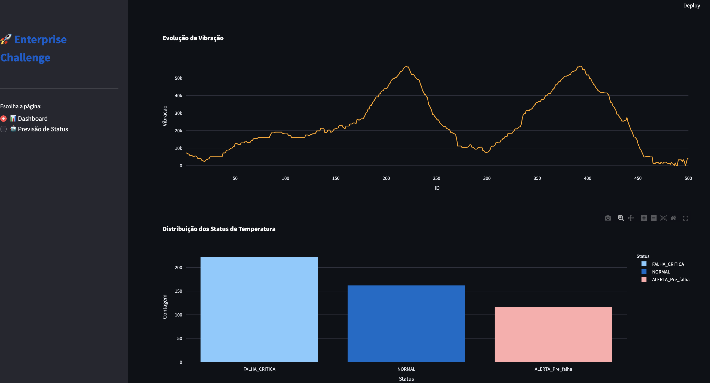
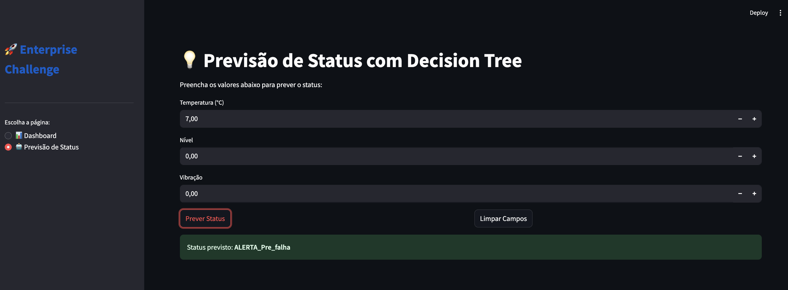
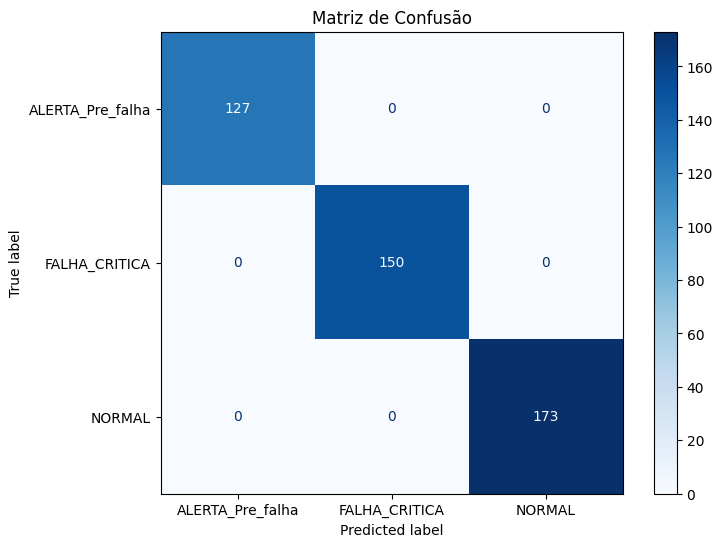

# FIAP - Faculdade de Informática e Administração Paulista

<p align="center">
  <a href="https://www.fiap.com.br/">
    
  </a>
</p>

---

# 📦 Enterprise Challenge - Sprint 4


## 👥 Grupo 18


## 👨‍🎓 Integrantes:
- Amanda Vieira Pires (RM5666330)
- Ana Gabriela Soares Santos (RM565235)
- Bianca Nascimento de Santa Cruz Oliveira (RM561390)
- Milena Pereira dos Santos Silva (RM565464)
- Nayana Mehta Miazaki (RM565045) 

## 👩‍🏫 Professores:
### Tutor(a)  
-  Lucas Gomes Moreira
### Coordenador(a)  
- André Godoi

---

## 📜 Descrição do Projeto  

Solução de **manutenção preditiva** em linhas de envase de bebidas.  
- **Sensores simulados (ESP32 + Wokwi):** temperatura (DS18B20), vibração (MPU6050) e nível (HC-SR04).  
- **Armazenamento:** SQLite.  
- **Análise preditiva:** modelo de Machine Learning (Árvore de Decisão).  
- **Visualização:** dashboard em Streamlit.  

---

## 🔧 Pipeline de Solução  

1. **Simulação de Sensores** → exporta dados em `.csv`.  
2. **Estruturação de Dados** → importação para SQLite (`import_data.py`).  
3. **Machine Learning** → treinamento e avaliação (`machine_learning.ipynb`).  
4. **Dashboard** → visualização de métricas e previsões.  

## 📁 Arquitetura final



---

## 🚀 Como Executar  

### Pré-requisitos  
- Python 3.8+  
- VS Code com: PlatformIO, Wokwi, Jupyter, SQLite Viewer  


### Passo a Passo
O processo completo é dividido em 4 fases principais: gerar os dados, estruturá-los no banco de dados, treinar o modelo de Machine Learning e apresentar os dados em Dashboard.

## 🔹 Fase 1: Geração de Dados Simulados (Wokwi)

Existem duas maneiras de gerar os dados. Escolha a que melhor se adapta à sua necessidade.

---

1. **Escolha o ambiente do sensor**  
   - Clique no ícone do PlatformIO (formiga) na barra lateral esquerda do VS Code.
   - Em PROJECT TASKS, expanda a lista e escolha o ambiente do sensor que deseja simular (ex: `sensor_nivel_hcsr04`).

2. **Compile o Código (Build):**  
   - Clique na opção Build dentro do ambiente escolhido. 
   - Aguarde a mensagem de SUCCESS no terminal. Esse processo também executa o script `update_diagram.py`, que atualiza o arquivo `diagram.json` com o circuito correto.

3. **Ajuste o `wokwi.toml`**  
   - Abra o arquivo `wokwi.toml` na raiz do projeto.
   - Altere a linha firmware para apontar para o arquivo `.elf` do sensor que você acabou de compilar. O caminho correto será exibido no terminal após o build.
     - Exemplo para o sensor de nível:
       
     ```toml
     firmware = ".pio/build/sensor_nivel_hcsr04/firmware.elf"
     ```

4. **Inicie a Simulação**  
   - Pressione F1 para abrir a paleta de comandos do VS Code. 
   - Digite e selecione Wokwi: Start Simulator.
   - A simulação iniciará em uma nova aba. Copie os dados gerados no Serial Monitor e salve-os no arquivo `.csv` correspondente dentro da pasta `data/`.

5. **Repita para os Outros Sensores**  
   - Para gerar os dados dos outros sensores, repita os passos de 1 a 4, selecionando o ambiente e atualizando o `wokwi.toml` para cada um.

---

## 🔹 Fase 2: Estruturação dos Dados

  1. Instale as dependências Python:
  ```bash
    pip install pandas scikit-learn matplotlib seaborn plotly
  ```

  2. Execute o script de importação para criar e popular o banco de dados `hermes_db.sqlite` e populá-lo com os dados dos arquivos CSV:
  ```bash
    python scripts/import_data.py
  ```

## 🔹 Fase 3: Análise com Machine Learning

  1. (Opcional) Análise Exploratória:
       - Abra o notebook `notebooks/grafico.ipynb`.
       - Execute as células para gerar gráficos individuais para cada tipo de sensor, permitindo uma visualização inicial dos dados coletados.
         
  2. Clique em "Executar Tudo" (Run All). O notebook irá treinar o modelo e exibir a Matriz de Confusão com os resultados.
       - Abra o notebook principal `notebooks/machine_learning.ipynb`.
       - Clique em **"Executar Tudo" (Run All)**. O notebook irá carregar os dados do banco, treinar o modelo de classificação e exibir a Matriz de Confusão com os resultados finais.

## 🔹 Fase 4: Dashboard

 1. Vá para a pasta /src/streamlit
 2. Execute o seguinte comando

  ```bash
    streamlit run app.py
  ```

3. Abra o seguinte endereço no navegador: http://localhost:8501/


## 📌 Justificativa da Escolha do Sensor

O sensor **DS18B20** foi escolhido para a leitura precisa de temperatura, o **MPU6050** para medir a vibração da máquina através de seu acelerômetro, e o **HC-SR04** para a medição do nível de enchimento sem contato com o produto. Em conjunto, esses sensores permitem simular um cenário realista de monitoramento em linhas de envase de bebidas, onde variações nessas três grandezas são indicadores críticos de possíveis falhas no processo.

---

## 🔌 Esquema dos Circuitos

## 💨 MPU6050

### ⚙️ Funcionamento do Sistema MPU6050

1. O ESP32 simulado lê a aceleração da máquina a cada 1 segundo através do MPU6050.
2. A vibração é simulada com valores variados, dependendo da movimentação dos eixos X, Y e Z.
3. Os dados são classificados automaticamente em três status:
   - **NORMAL**: até 16500.0LSB/g
   - **ALERTA_Pre_falha**: de 16500.0LSB/g até 25000.0LSB/g
   - **FALHA_CRITICA**: acima de 25000.0LSB/g
4. Os dados são exibidos no **Monitor Serial** no formato CSV:  
   `ID, Aceleracao_Total, Status`

---

### 🔌 Simulação no Wokwi - MPU6050 e ESP32



---

## 🌡️ DS18B20

### ⚙️ Funcionamento do Sistema DS18B20

1. O ESP32 simulado lê a temperatura da máquina a cada 1 segundo através do DS18B20.
2. A temperatura é simulada com valores variados, conforme a oscilação.
3. Os dados são classificados automaticamente em três status:
   - **NORMAL**: de -1ºC até 6ºC
   - **ALERTA_Pre_falha**: de 6.1ºC até 10ºC ou de -1.1ºC até -6ºC 
   - **FALHA_CRITICA**: acima de 10ºC ou abaixo de -6.1ºC
4. Os dados são exibidos no **Monitor Serial** no formato CSV:  
   `ID, Temperatura, Status`

---

### 🔌 Simulação no Wokwi - DS18B20 e ESP32


---

## 〰️ HC-SR04

### ⚙️ Funcionamento do Sistema HC-SR04

1. O ESP32 simulado lê a distância do líquido até o sensor HC-SR04 a cada 1 segundo.
2. A temperatura é simulada com valores variados, conforme a oscilação.
3. Os dados são classificados automaticamente em três status:
   - **NORMAL**: acima de 20cm
   - **ALERTA_Pre_falha**: de 16 a 18cm
   - **FALHA_CRITICA**: abaixo de 16cm
4. Os dados são exibidos no **Monitor Serial** no formato CSV:  
   `ID, Distancia_cm, Nivel_cm, Status`

---

### 🔌 Simulação no Wokwi - HC-SR04 e ESP32


---

## ✅ Insights Iniciais

- **NORMAL**
- **ALERTA_Pre_falha**
- **FALHA_CRITICA**

Essa análise demonstra que o sistema de simulação e classificação está funcionando conforme esperado, permitindo a identificação clara de mudanças na vibração, temperatura e nível de enchimento. Isso é essencial para o monitoramento preventivo e tomada de decisão.

Essa categorização tem como objetivo simular o comportamento de um sistema embarcado que não apenas coleta dados, mas também realiza uma **análise embarcada**, classificando os dados com base em faixas de operação seguras ou críticas. Essa estratégia permite que o dispositivo reaja localmente ou envie alertas para a nuvem em casos de falha iminente, antecipando paradas e aumentando a confiabilidade do processo industrial.

Os gráficos apresentados anteriormente, também fornecem uma visão clara da transição entre os diferentes estados, evidenciando o momento em que o sistema passa de uma operação estável para condições críticas.

---

## 📊 Banco de Dados

Para armazenar os dados de forma estruturada, foi projetado um banco de dados relacional simples e eficiente, implementado em SQLite. Esta abordagem garante a integridade e facilita as consultas complexas necessárias para a análise de Machine Learning.

### Diagrama Entidade-Relacionamento (DER)
O diagrama abaixo ilustra a modelagem, com suas entidades, atributos e relacionamentos.



### Descrição das Entidades e Relacionamentos

A modelagem de dados foi estruturada para refletir o ambiente industrial de forma clara e normalizada:

* **MAQUINAS:** Entidade central que representa os equipamentos físicos na linha de produção.
    * `id_maquina`: Chave primária para identificação única.
    * `nome`, `localizacao`: Atributos que descrevem a máquina.

* **SENSORES:** Representa os dispositivos de coleta de dados instalados nas máquinas.
    * `id_sensor`: Chave primária.
    * `id_maquina`: Chave estrangeira que estabelece o relacionamento **(1:N)** com a tabela `MAQUINAS`, indicando que **uma máquina pode ter vários sensores**.
    * `tipologia`: Descreve o tipo de dado que o sensor coleta (temperatura, vibração, etc.).

* **MEDICAO_VIBRACAO / TEMPERATURA / NIVEL:** Tabelas que armazenam os dados históricos de cada sensor.
    * `id`: Chave primária para cada registro de medição.
    * `id_sensor`: Chave estrangeira que estabelece o relacionamento **(1:N)** com a tabela `SENSORES`, indicando que **um sensor pode realizar múltiplas medições** ao longo do tempo.
    * `aceleracao_total`, `medicao`, `nivel_cm`: Atributos que guardam o valor numérico da leitura.
    * `status`: Campo que armazena a classificação da medição, fundamental para o treinamento do modelo de ML.

### Automação da Criação e Povoamento

Para garantir a consistência e reprodutibilidade do projeto, todo o processo de criação e povoamento do banco foi automatizado:

1.  **`schema.sql`:** Um único script contém todo o código DDL (Data Definition Language) para criar as tabelas e definir os relacionamentos (`FOREIGN KEY`), garantindo a integridade referencial.
2.  **`import_data.py`:** Este script Python utiliza a biblioteca `sqlite3` e `pandas` para:
    * Criar o banco `hermes_db.sqlite` executando o `schema.sql`.
    * Inserir os dados estáticos das máquinas e tipos de sensores.
    * Ler os arquivos `medicao_*.csv`, processá-los e inseri-los nas tabelas de medição correspondentes.

### Dashboard

O Dashboard foi criado com o streamlit com o objetivo de apresentar métricas, gráficos e tornar o modelo de Machine Learning utilizável. Seguem abaixo imagens da interface:









---

# 📜 Etapas

## 1. Cadastro de máquinas
Há necessidade de cadastrar todas as máquinas da indústria.

📊 **Dados Necessários**
- Nome da máquina
- Localização da máquina dentro da indústria

## 2. Identificação dos sensores
Há necessidade de identificação de todos os sensores presentes nas máquinas.

📊 **Dados Necessários**
- Tipologia
- Máquina localizada

## 3. Recebimento de dados de sensores
O sistema deverá receber os dados de cada sensor.

📊 **Dados Recebidos**
- Medição
- Status

## 4. Banco de dados
A partir das informações recebidas e registradas, deverão ser armazenadas em um banco de dados. 

> Os relacionamentos entre as entidades irão proporcionar insights valiosos que poderão ser detectados pelo modelo preditivo.

---

## 🖥️ Machine Learning

O objetivo do modelo de Machine Learning é classificar o status de operação com base nas leituras dos sensores. O processo foi documentado no notebook `machine_learning.ipynb`.

1.  **Carga e Unificação dos Dados**
    
    Os dados de todas as tabelas de medição foram unificados com uma consulta SQL diretamente no banco de dados, criando um único DataFrame para o treinamento.

    ```python
    # Unifica os dados de todos os sensores
    query = """
    SELECT 'nivel' as tipo, nivel_cm as medicao, status FROM MEDICAO_NIVEL
    UNION ALL
    SELECT 'temperatura' as tipo, medicao, status FROM MEDICAO_TEMPERATURA
    UNION ALL
    SELECT 'vibracao' as tipo, aceleracao_total as medicao, status FROM MEDICAO_VIBRACAO;
    """
    df = pd.read_sql_query(query, conn)
    ```

2.  **Treinamento do Modelo**
    
    Foi utilizado um modelo de Árvore de Decisão (DecisionTreeClassifier), escolhido por sua simplicidade e interpretabilidade. Os dados foram divididos em 70% para treino e 30% para teste.

3.  **Resultados e Avaliação**
    
    O modelo alcançou uma acurácia de 100% no conjunto de teste. Este resultado perfeito é esperado, pois os dados foram gerados com regras de classificação claras. Isso valida que o modelo aprendeu perfeitamente as regras definidas, servindo como uma excelente prova de conceito. Todavia, em um cenário real, os dados teriam mais "ruído" e as fronteiras entre as classes não seriam tão perfeitas, o que levaria a uma acurácia menor, mas ainda assim o modelo seria útil.
    
    Para visualizar a performance, foi gerada uma Matriz de Confusão.

    

4.  **Justificativa da Visualização**
    
    A Matriz de Confusão é a ferramenta padrão para avaliar modelos de classificação. A diagonal principal mostra o número de previsões corretas para cada classe. No nosso caso, todos os valores estão na diagonal principal, confirmando que o modelo classificou todas as 450 amostras de teste corretamente, sem nenhum erro. Isso é muito mais informativo do que apenas a acurácia geral.


## 📁 Estrutura do Repositório

```bash
/enterprise-challenge-phase04
/
├── .sql/
│   └── schema.sql                  # Script DDL para criação da estrutura do banco
│
├── data/
│   ├── medicao_nivel.csv           # Dados simulados do sensor de nível
│   ├── medicao_temperatura.csv     # Dados simulados do sensor de temperatura
│   └── medicao_vibracao.csv        # Dados simulados do sensor de vibração
│
├── .json/
│   ├── diagram_DS18B20.json        # Diagrama de circuito para o Wokwi
│   ├── diagram_HC-SR04.json        # "
│   └── diagram_MPU6050.json        # "
│
├── notebooks/
│   ├── grafico.ipynb               # (Opcional) Notebook para geração de gráficos avulsos
│   └── machine_learning.ipynb      # Notebook principal com o treino e avaliação do modelo
│   └── decision_tree_model.pkl     # Modelo treinado exportado
│  
├── scripts/
│   ├── update_diagram.py           # Script para atualizar o diagrama do Wokwi automaticamente
|   └── import_data.py              # Script para popular banco de dados com dados de medição
│
├── src/
│   ├── ds18b20_main.cpp            # Código-fonte da simulação para o sensor de temperatura
│   ├── hcsr04_main.cpp             # Código-fonte da simulação para o sensor de nível
│   └── mpu6050_main.cpp            # Código-fonte da simulação para o sensor de vibração
│
├── .gitignore                      # Arquivos ignorados pelo Git
├── diagram.json                    # Arquivo de diagrama ATUAL do Wokwi (gerado via script)
├── platformio.ini                  # Configuração do PlatformIO com múltiplos ambientes
├── README.md                       # Esta documentação
└── wokwi.toml                      # Configuração do Wokwi para carregar o firmware
```
---

## 🧠 Conclusão

O produto final atende aos requisitos de coletar, armazenar, treinar e exibir os dados e métricas. O funcionamento dele é local, não foi disponibilizado em ambiente produtivo. Como ponto a melhorar, caso dê continuidade, é a disponibilização em ambiente AWS.

---

## 🎬 Vídeo Explicativo

Assista ao vídeo de até 5 minutos explicando e justificando o projeto desta fase:

[Link para o vídeo no YouTube (Não Listado)](https://www.youtube.com/watch?v=MVAWUlgGIO0)

---

## 📜 Licença

Este projeto está licenciado sob os termos da licença **CC BY 4.0**.

---
