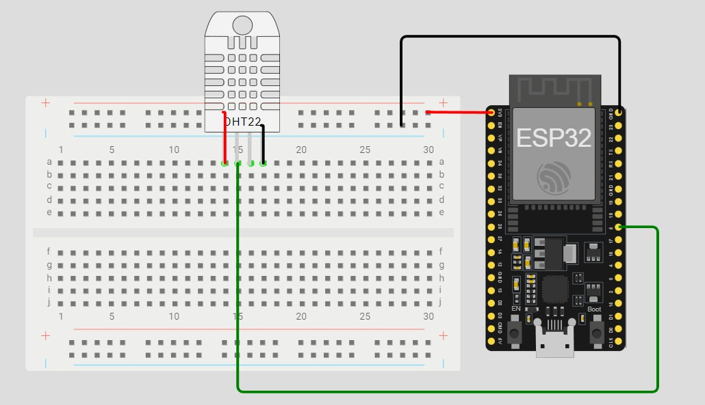
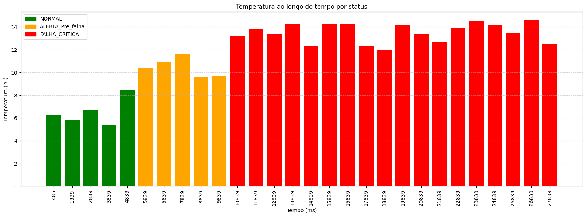

# FIAP - Faculdade de Informática e Administração Paulista

<p align="center">
  <a href="https://www.fiap.com.br/">
    
  </a>
</p>

---

# 📦 Enterprise Challenge - Sprint 2
<!-- Título do projeto: curto, claro, direto. Pode destacar o problema e a tecnologia principal -->

## 👥 Grupo 
<!-- Nome oficial do grupo, se houver. Pode usar um nome criativo também -->

## 👨‍🎓 Integrantes:
- Amanda Vieira Pires (RM565045)
- Ana Gabriela Soares Santos (RM565235)
- Bianca Nascimento de Santa Cruz Oliveira (RM561390)
- Milena Pereira dos Santos Silva (RM565464)
- Nayana Mehta Miazaki (RM565045) 

## 👩‍🏫 Professores:
### Tutor(a)  
-  Lucas Gomes Moreira
### Coordenador(a)  
- André Godoi

---

# 📜 Descrição do Projeto
## 🎯 Objetivo

- Criar um circuito virtual com ESP32 e sensor DHT22 no Wokwi;
- Simular variações de temperatura conforme diferentes momentos de operação;
- Classificar os valores em três categorias: `NORMAL`, `ALERTA_Pre_falha` e `FALHA_CRITICA`;
- Registrar os dados via Monitor Serial;
- Exportar os dados simulados para CSV;
- Gerar um gráfico simples com base nos dados simulados;
- Documentar todo o processo no GitHub com prints, código e análise.

---

## 🔧 Estrutura de Simulação

- **Plataforma de Simulação:** Wokwi
- **Microcontrolador:** ESP32 (simulado)
- **Linguagem:** C++ (com base na plataforma PlataformIO com VS Code)
- **Sensor Utilizado:**  
  - `DHT22`: sensor digital de temperatura e umidade
- **Biblioteca `DHT` da Adafruit**

---

## 📌 Justificativa da Escolha do Sensor

O sensor **DHT22** foi escolhido por sua ampla utilização na indústria para controle ambiental, oferecendo leitura precisa de **temperatura e umidade**, o que permite simular falhas térmicas em ambientes como linhas de produção.

---

## 🔌 Esquema do Circuito


---

## 🧾 Trecho Representativo do Código

O trecho abaixo representa a lógica principal do projeto, responsável por:

- Simular a leitura de temperatura com base no tempo de execução do sistema;
- Classificar o status do sistema em três níveis: `NORMAL`, `ALERTA_Pre_falha` ou `FALHA_CRITICA`;
- Exibir os dados simulados no Monitor Serial em formato CSV (separado por vírgulas), facilitando análise posterior ou exportação.

```cpp
// Trecho representativo da leitura e visualização dos dados

float tempSimulada = simularTemperatura(tempo_atual);  // Gera um valor simulado de temperatura baseado no tempo
String status = classificarStatus(tempSimulada);       // Classifica a temperatura em NORMAL, ALERTA ou FALHA

// Exibe os dados formatados no Monitor Serial
Serial.print(tempo_atual);
Serial.print(",");
Serial.print(tempSimulada, 1);
Serial.print(",");
Serial.println(status);
```
---

## ⚙️ Funcionamento do Sistema

1. O ESP32 simulado lê a temperatura do sensor DHT22 a cada 1 segundo.
2. A temperatura é simulada com valores variados, dependendo do tempo de execução.
3. Os dados são classificados automaticamente em três status:
   - **NORMAL**: até 9,0°C
   - **ALERTA_Pre_falha**: de 9,1°C até 11,9°C
   - **FALHA_CRITICA**: acima de 12,0°C
4. Os dados são exibidos no **Monitor Serial** no formato CSV:  
   `Tempo_ms,Temperatura_C,Status`

---

## 🧪 Exemplo de Dados Coletados

| Tempo_ms | Temperatura_C | Status           |
|----------|----------------|------------------|
| 485      | 6.3            | NORMAL           |
| 5839     | 10.4           | ALERTA_Pre_falha |
| 10839    | 13.2           | FALHA_CRITICA    |


---

## 📊 Gráfico Gerado



---

## 🔍 Insights 

O gráfico acima representa a evolução da temperatura simulada ao longo do tempo, com a classificação automática em três categorias de status:

- 🟩 **NORMAL (verde)**: Temperatura abaixo ou igual a 9 °C
- 🟧 **ALERTA_Pre_falha (laranja)**: Temperatura entre 9.1 °C e 11.9 °C
- 🟥 **FALHA_CRITICA (vermelho)**: Temperatura acima de 12 °C

### ✅ Observações

- **Início da simulação (até 4839 ms)**: Os dados simulados mostram uma temperatura estável em níveis seguros (entre 5.4 °C e 8.5 °C), classificados como **NORMAL**.
- **Entre 5839 ms e 9839 ms**: A temperatura entra em uma faixa de risco intermediária (9.6 °C a 11.6 °C), sendo corretamente classificada como **ALERTA_Pre_falha**.
- **A partir de 10839 ms**: A temperatura ultrapassa os 12 °C e se mantém em níveis críticos durante toda a simulação restante (com picos acima de 14 °C), sendo identificada como **FALHA_CRITICA**.

- As faixas de temperatura simuladas refletem **comportamentos distintos operacionais**, com **zonas claras de risco** após os 10 segundos de simulação.
- A visualização permite **identificar tendências de aquecimento anormal**, o que, em um cenário real, poderia acionar ações preventivas de manutenção.

Essa análise demonstra que o sistema de simulação e classificação está funcionando conforme esperado, permitindo a identificação clara de mudanças nos níveis térmicos simulados. Isso é essencial para o monitoramento preventivo e tomada de decisão em sistemas embarcados sensíveis à temperatura.

### 📈 Estatísticas das Temperaturas por Status

| Status             | Temperatura Média (°C) | Desvio Padrão (°C) |
|--------------------|------------------------|---------------------|
| NORMAL             | 6.54                   | 1.20                |
| ALERTA_Pre_falha   | 10.44                  | 0.84                |
| FALHA_CRITICA      | 13.52                  | 0.85                |

---

## 📁 Estrutura do Repositório

```bash
/enterprise-challenge-phase04
├── src/
│   ├──main.cpp
│
├── diagram.json                # Circuito simulado no Wokwi
├── platformio.ini              # Configuração do PlatformIO
├── wokwi.toml                  # Caminho para firmware na simulação
├── dados_temperatura.csv       # Registro dos dados
│
├── img/                        # Imagens utilizadas no README
│   ├── circuito.png            # Print do circuito no Wokwi
│   ├── logo_fiap.png           # Logo da faculdade
│   ├── grafico.png             # Imagem do gráfico
│
├── .gitignore                  # Arquivos/pastas ignorados pelo Git
└── README.md                   # Documentação geral do projeto
```
---

## 🧠 Conclusão

A simulação do sensor DHT22 no Wokwi demonstrou a viabilidade de todo o fluxo de aquisição e classificação de dados no ESP32. Foi implementada a geração de dados simulados com base no tempo de execução, seguida de uma lógica embarcada para categorização automática dos valores de temperatura em três estados operacionais: **NORMAL**, **ALERTA_Pre_falha** e **FALHA_CRITICA**.

Os dados foram exportados para análise em Python, com geração de gráfico e cálculo de média e desvio padrão por categoria. O experimento evidenciou a integração entre hardware embarcado e ferramentas de análise, validando o modelo de monitoramento e detecção de anomalias.

---

## 📜 Licença

Este projeto está licenciado sob os termos da licença **CC BY 4.0**.

---
