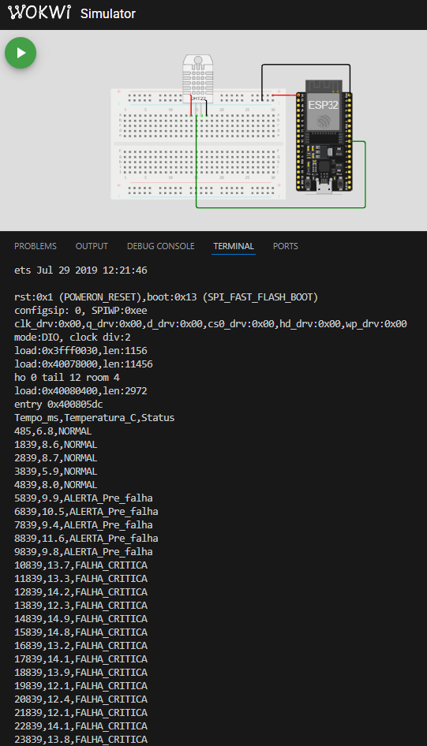
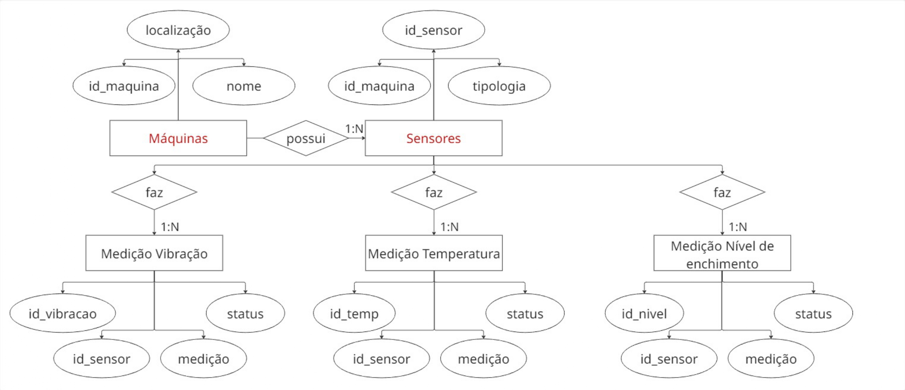

# FIAP - Faculdade de Informática e Administração Paulista

<p align="center">
  <a href="https://www.fiap.com.br/">
    
  </a>
</p>

---

# 📦 Enterprise Challenge - Sprint 3
<!-- Título do projeto: curto, claro, direto. Pode destacar o problema e a tecnologia principal -->

## 👥 Grupo 26
<!-- Nome oficial do grupo, se houver. Pode usar um nome criativo também -->

## 👨‍🎓 Integrantes:
- Amanda Vieira Pires (RM565045)
- Ana Gabriela Soares Santos (RM565235)
- Bianca Nascimento de Santa Cruz Oliveira (RM561390)
- Milena Pereira dos Santos Silva (RM565464)
- Nayana Mehta Miazaki (RM565045) 

## 👩‍🏫 Professores:
### Tutor(a)  
-  Lucas Gomes Moreira
### Coordenador(a)  
- André Godoi

---

# 📜 Descrição do Projeto
## 🚀 Introdução

Dando continuidade ao projeto voltado à **manutenção preditiva em linhas de envase da indústria de bebidas**, após a segunda etapa que teve como foco a simulação de um sistema embarcado responsável pela aquisição local de dados sensoriais, inicia-se a terceira etapa. Nesta etapa, os dados captados pelos sensores serão armazenados de forma estruturada para que um algoritmo de Machine Learning busque insights valiosos para a indústria.  

<!-- Após a construção de um circuito simulado com ESP32 e sensor DHT22 no ambiente Wokwi, representando um cenário em que, variações de temperatura poderiam sinalizar diferentes estados operacionais da linha de produção — de operação normal até falhas críticas. Os dados foram classificados localmente e exportados para posterior visualização e análise gráfica, reforçando a importância do monitoramento em tempo real para a detecção precoce de anomalias.-->

Link do repositório Sprint 1: https://github.com/fiap-ia-2025/enterprise-challenge-phase03

---

## 🎯 Objetivo

- Criar três circuitos virtuais com ESP32 e sensores no Wokwi;
- Simular variações de temperatura, vibração e nível de enchimento conforme diferentes momentos de operação;
- Classificar os valores em três categorias: `NORMAL`, `ALERTA_Pre_falha` e `FALHA_CRITICA`;
- Registrar os dados via Monitor Serial;
- Exportar os dados simulados para CSV;
- Gerar uma modelagem de dados relacional;
- Criar um banco de dados;
- Treinar um algoritmos de machine learning para obter insights;
- Documentar todo o processo no GitHub com prints, código e análise.

---

## 🔧 Estrutura de Simulação

- **Plataforma de Simulação:** Wokwi
- **Microcontrolador:** ESP32 (simulado)
- **Linguagem:** C++ (com base na plataforma PlataformIO com VS Code)
- **Sensor Utilizado:**  
  - `DS18B20`: sensor de temperatura digital
  - `MPU6050`: acelerômetro e giroscópio
  - `HC-SR04`: sensor de distância ultrassônico

---

## 📌 Justificativa da Escolha do Sensor

O sensor **DS18B20** foi escolhido para este projeto, pois oferece leitura precisa de **temperatura** das máquinas e não requer calibração externa, isso garante leituras confiáveis para o monitoramento de processos de envase na indústria. <br> 

Já o sensor **MPU6050**, utilizado para medir a vibração da máquina, realiza a medição de aceleramento nos três eixos X, Y e Z, detectando a intensidade e frequência das vibrações. <br> 

Por último, o sensor **HC-SR04** para fazer a medição do nível de enchimento sem fazer contato com o produto. Ele fica posicionado acima do recipiente, emite uma onda sonora e realiza a medição do tempo que o eco leva para retornar, e assim calcula-se a distância até a superfície do líquido. <br>

Nesse contexto de linhas de envase de cervejas e refrigerantes, os sensores citados acima, permitem simular as possíveis falhas durante o processo. As indústrias de bebidas enfrentam desafios frequentemente, que podem estar associados a pequenas variações na temperatura, vibração ou quantidade de líquido inserido nos produtos, que ao passar despercebidas por sistemas de monitoramentos tradicionais, podem causar interrupções significativas. Ao utilizar os sensores podemos recriar e analizar cenários onde essas condições impactam diretamente na linha de produção, para então desenvolver e testar soluções de predição e automação, capazes de identificar as anomalias e evitar falhas críticas, otimizando as operações nas linhas de envase de cervejas e refrigerantes.

---

## 🔌 Esquema dos Circuitos

### MPU5060


---

## 🧾 Trecho Representativo do Código

O trecho abaixo representa a lógica principal do projeto, responsável por:

- Simular a leitura de temperatura com base no tempo de execução do sistema;
- Classificar o status do sistema em três níveis: `NORMAL`, `ALERTA_Pre_falha` ou `FALHA_CRITICA`;
- Exibir os dados simulados no Monitor Serial em formato CSV (separado por vírgulas), facilitando análise posterior ou exportação.

```cpp
// Trecho representativo da leitura e visualização dos dados

float tempSimulada = simularTemperatura(tempo_atual);  // Gera um valor simulado de temperatura baseado no tempo
String status = classificarStatus(tempSimulada);       // Classifica a temperatura em NORMAL, ALERTA ou FALHA

// Exibe os dados formatados no Monitor Serial
Serial.print(tempo_atual);
Serial.print(",");
Serial.print(tempSimulada, 1);
Serial.print(",");
Serial.println(status);
```
---

## ⚙️ Funcionamento do Sistema

1. O ESP32 simulado lê a temperatura do sensor DHT22 a cada 1 segundo.
2. A temperatura é simulada com valores variados, dependendo do tempo de execução.
3. Os dados são classificados automaticamente em três status:
   - **NORMAL**: até 9,0°C
   - **ALERTA_Pre_falha**: de 9,1°C até 11,9°C
   - **FALHA_CRITICA**: acima de 12,0°C
4. Os dados são exibidos no **Monitor Serial** no formato CSV:  
   `Tempo_ms,Temperatura_C,Status`

---

## 🔌 Simulação no Wokwi - DHT22 e ESP32


---

## 🧪 Exemplo de Dados Coletados

| Tempo_ms | Temperatura_C | Status           |
|----------|----------------|------------------|
| 485      | 6.3            | NORMAL           |
| 5839     | 10.4           | ALERTA_Pre_falha |
| 10839    | 13.2           | FALHA_CRITICA    |

---

## 📊 Gráfico Gerado


### 📝 Estrutura e Racional do Gráfico

O gráfico gerado apresenta a variação da temperatura simulada ao longo do tempo, com o eixo X representando o tempo em milissegundos (`Tempo_ms`) e o eixo Y representando a temperatura em graus Celsius (`Temperatura_C`). Para facilitar a interpretação, os pontos foram coloridos conforme a **classificação automática do status operacional**:

- **NORMAL (verde)**: Temperatura abaixo ou igual a 9 °C - operação dentro do esperado.
- **ALERTA_Pre_falha (laranja)**: Temperatura entre 9.1 °C e 11.9 °C - possível instabilidade térmica, atenção recomendada.
- **FALHA_CRITICA (vermelho)**: Temperatura acima de 12 °C - – indicativo de falha crítica ou sobreaquecimento, requer ação imediata.

Essa categorização tem como objetivo simular o comportamento de um sistema embarcado que não apenas coleta dados, mas também realiza uma **análise embarcada em tempo real**, classificando os dados com base em faixas de operação seguras ou críticas. Essa estratégia permite que o dispositivo reaja localmente ou envie alertas para a nuvem em casos de falha iminente, antecipando paradas e aumentando a confiabilidade do processo industrial.

O gráfico também fornece uma visão clara da transição entre os diferentes estados, evidenciando o momento em que o sistema passa de uma operação estável para condições críticas.

---

## ✅ Insights Iniciais

- **Início da simulação (até 4839 ms)**: Os dados simulados mostram uma temperatura estável em níveis seguros (entre 5.4 °C e 8.5 °C), classificados como **NORMAL**.
- **Entre 5839 ms e 9839 ms**: A temperatura entra em uma faixa de risco intermediária (9.6 °C a 11.6 °C), sendo corretamente classificada como **ALERTA_Pre_falha**.
- **A partir de 10839 ms**: A temperatura ultrapassa os 12 °C e se mantém em níveis críticos durante toda a simulação restante (com picos acima de 14 °C), sendo identificada como **FALHA_CRITICA**.

- As faixas de temperatura simuladas refletem **comportamentos distintos operacionais**, com **zonas claras de risco** após os 10 segundos de simulação.
- A visualização permite **identificar tendências de aquecimento anormal**, o que, em um cenário real, poderia acionar ações preventivas de manutenção.

Essa análise demonstra que o sistema de simulação e classificação está funcionando conforme esperado, permitindo a identificação clara de mudanças nos níveis térmicos simulados. Isso é essencial para o monitoramento preventivo e tomada de decisão em sistemas embarcados sensíveis à temperatura.

### 📈 Estatísticas das Temperaturas por Status

| Status             | Temperatura Média (°C) | Desvio Padrão (°C) |
|--------------------|------------------------|---------------------|
| NORMAL             | 6.54                   | 1.20                |
| ALERTA_Pre_falha   | 10.44                  | 0.84                |
| FALHA_CRITICA      | 13.52                  | 0.85                |

---

# 🔍 Entidades e Atributos



## MAQUINAS

- id_maquina
- nome (maquina_1, maquina_2, maquina_3)
- localizacao (sala_1, sala_2)

## SENSORES

- id_sensor
- id_maquina
- tipologia (temperatura, pressao, vibracao)

## MEDICAO

- id_medicao
- id_sensor
- medicao (resultado da medição dos sensores)
- data_medicao (quando foi feito a medição)

## CLASSIFICACAO

- id_classe
- id_medicao
- classificacao (NORMAL, ALERTA_Pre_falha, FALHA_CRITICA)

# 🔗 Relacionamentos (Cardinalidades)

| Entidade 1 | Relacionamento | Entidade 2    | Cardinalidade | Observação                                            |
|------------|----------------|---------------|---------------|-------------------------------------------------------|
| Maquinas   | possui         | Sensores      | 1:1           | Uma máquina pode medir apenas um sensor               |
| Sensores   | faz            | Medicao       | 1:N           | Um equipamento de sensores pode fazer várias medições |
| Medicao    | resulta        | Classificacao | 1:1           | Uma medição pode resultar em apenas uma classificação |


## 📁 Estrutura do Repositório

```bash
/enterprise-challenge-phase04
├── src/
│   ├──main.cpp
│
├── diagram.json                # Circuito simulado no Wokwi
├── platformio.ini              # Configuração do PlatformIO
├── wokwi.toml                  # Caminho para firmware na simulação
├── dados_temperatura.csv       # Registro dos dados
├── grafico.ipynb               # Gráfico de temperatura simulada
│ 
├── img/                        # Imagens utilizadas no README
│   ├── circuito.png            # Print do circuito no Wokwi
│   ├── logo_fiap.png           # Logo da faculdade
│   ├── grafico.png             # Imagem do gráfico
│   ├── simulacao.png           # Imagem da simulação no Wokwi
       
│
├── .gitignore                  # Arquivos/pastas ignorados pelo Git
└── README.md                   # Documentação geral do projeto
```
---

## 🧠 Conclusão

A simulação do sensor DHT22 no Wokwi demonstrou a viabilidade de todo o fluxo de aquisição e classificação de dados no ESP32. Foi implementada a geração de dados simulados com base no tempo de execução, seguida de uma lógica embarcada para categorização automática dos valores de temperatura em três estados operacionais: **NORMAL**, **ALERTA_Pre_falha** e **FALHA_CRITICA**.

Os dados foram exportados para análise em Python, com geração de gráfico e cálculo de média e desvio padrão por categoria. O experimento evidenciou a integração entre hardware embarcado e ferramentas de análise, validando o modelo de monitoramento e detecção de anomalias.

---

## 📜 Licença

Este projeto está licenciado sob os termos da licença **CC BY 4.0**.

---
