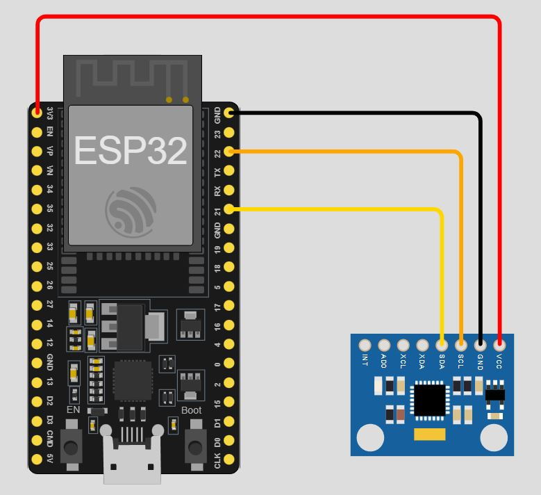
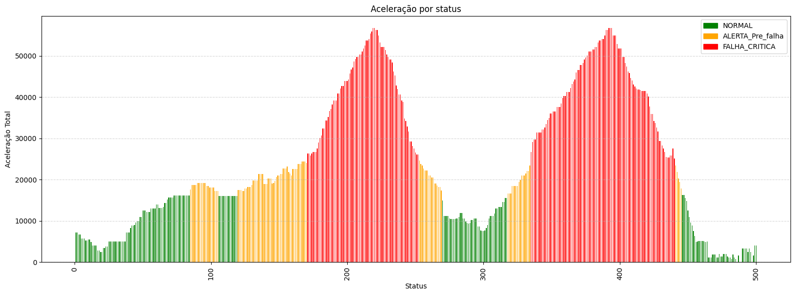
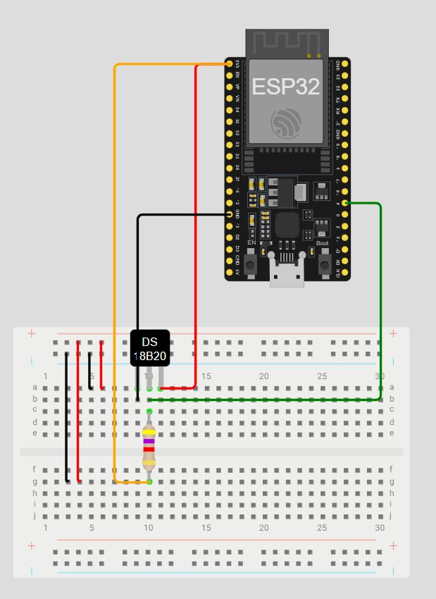
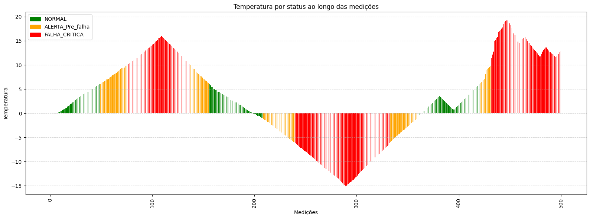
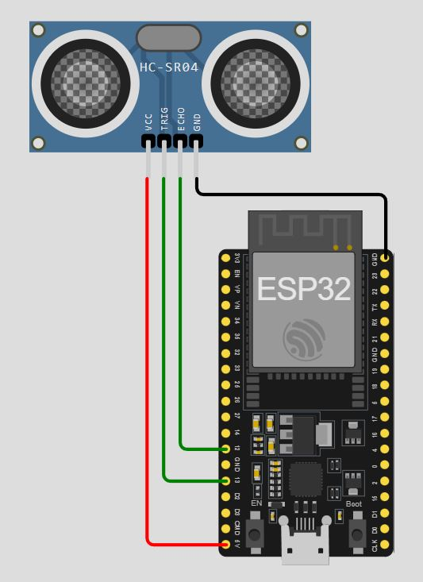

# FIAP - Faculdade de Informática e Administração Paulista

<p align="center">
  <a href="https://www.fiap.com.br/">
    
  </a>
</p>

---

# 📦 Enterprise Challenge - Sprint 3
<!-- Título do projeto: curto, claro, direto. Pode destacar o problema e a tecnologia principal -->

## 👥 Grupo 26
<!-- Nome oficial do grupo, se houver. Pode usar um nome criativo também -->

## 👨‍🎓 Integrantes:
- Amanda Vieira Pires (RM565045)
- Ana Gabriela Soares Santos (RM565235)
- Bianca Nascimento de Santa Cruz Oliveira (RM561390)
- Milena Pereira dos Santos Silva (RM565464)
- Nayana Mehta Miazaki (RM565045) 

## 👩‍🏫 Professores:
### Tutor(a)  
-  Lucas Gomes Moreira
### Coordenador(a)  
- André Godoi

---

# 📜 Descrição do Projeto
## 🚀 Introdução

Dando continuidade ao projeto de **manutenção preditiva em linhas de envase**, esta fase avança da simulação de sensores para a estruturação e análise de dados. Transformamos os dados coletados em um banco de dados relacional robusto e, a partir dele, desenvolvemos um modelo de Machine Learning para extrair insights valiosos. Esta etapa representa um ciclo completo de uma solução de digitalização industrial, conectando a coleta de dados, o armazenamento estruturado e a aplicação de inteligência preditiva. 

<!-- Após a construção de um circuito simulado com ESP32 e sensor DHT22 no ambiente Wokwi, representando um cenário em que, variações de temperatura poderiam sinalizar diferentes estados operacionais da linha de produção — de operação normal até falhas críticas. Os dados foram classificados localmente e exportados para posterior visualização e análise gráfica, reforçando a importância do monitoramento em tempo real para a detecção precoce de anomalias.-->

Link do repositório Sprint 1: https://github.com/fiap-ia-2025/enterprise-challenge-phase03

---

## 🎯 Objetivo

- **Modelar um banco de dados relacional** funcional e normalizado para os dados dos sensores.
- **Criar um script SQL (`schema.sql`)** para definir a estrutura do banco.
- **Desenvolver um script Python (`import_data.py`)** para automatizar a criação e o povoamento do banco de dados a partir dos arquivos CSV.
- **Treinar um algoritmo de Machine Learning** para classificar o status operacional (`NORMAL`, `ALERTA_Pre_falha`, `FALHA_CRITICA`).
- **Gerar e justificar visualizações** que demonstrem a performance do modelo.
- **Documentar todo o processo** no GitHub, garantindo clareza e reprodutibilidade.

---

## 🔧 Arquitetura da Solução

O projeto foi estruturado como um pipeline de dados integrado, garantindo um fluxo contínuo desde a coleta até a análise preditiva:

- **Simulação de Sensores (Wokwi):** Circuitos com ESP32 e sensores (DS18B20, MPU6050, HC-SR04) geram dados brutos.
- **Exportação de Dados (CSV):** As leituras simuladas são salvas em arquivos `.csv`.
- **Banco de Dados (SQLite):** Um script Python (`import_data.py`) utiliza um esquema (`schema.sql`) para criar um banco de dados SQLite e importar os dados dos CSVs de forma automatizada.
- **Machine Learning (Jupyter Notebook):** O notebook (`machine_learning.ipynb`) conecta-se ao banco de dados para treinar, testar e avaliar um modelo de classificação com `Scikit-learn`.

---

## 🚀 Como Executar o Projeto

Siga os passos abaixo para configurar e executar o projeto completo, desde a criação do banco de dados até o treinamento do modelo de Machine Learning.

### 📋 Pré-requisitos

Antes de começar, garanta que você tenha os seguintes softwares instalados:
- [Git](https://git-scm.com/)
- [Python 3.8+](https://www.python.org/downloads/)
- [Visual Studio Code](https://code.visualstudio.com/)
- A extensão [Jupyter](https://marketplace.visualstudio.com/items?itemName=ms-toolsai.jupyter) para o VS Code.

### Passo a Passo

1.  **Clone o Repositório**

    Abra um terminal e clone o repositório do projeto para a sua máquina local:
    ```bash
    git clone [https://github.com/fiap-ia-2025/enterprise-challenge-phase04.git](https://github.com/fiap-ia-2025/enterprise-challenge-phase04.git)
    cd enterprise-challenge-phase04
    ```

2.  **Instale as Dependências**

    Instale as bibliotecas Python necessárias para a análise de dados e machine learning executando o seguinte comando no seu terminal:
    ```bash
    pip install pandas scikit-learn matplotlib seaborn
    ```

3.  **Crie e Povoe o Banco de Dados**

    Execute o script `import_data.py` para criar o banco de dados SQLite (`hermes_db.sqlite`) e carregar todos os dados dos arquivos `.csv` automaticamente.

    ```bash
    python import_data.py
    ```
    Ao final da execução, você verá a mensagem: `Banco de dados 'hermes_db.sqlite' criado e populado com sucesso!` e o arquivo aparecerá na raiz do projeto.

4.  **Execute a Análise de Machine Learning no VS Code**

    Abra a pasta do projeto no Visual Studio Code. Em seguida, abra o arquivo `machine_learning.ipynb`.
    
    No canto superior do notebook, clique no botão **"Executar Tudo" (Run All)**.
    
    Isso executará todas as células em sequência, realizando a carga dos dados do banco, o treinamento do modelo e a geração da matriz de confusão no final do arquivo.

---

## 📌 Justificativa da Escolha do Sensor

O sensor **DS18B20** foi escolhido para este projeto, pois oferece leitura precisa de **temperatura** das máquinas e não requer calibração externa, isso garante leituras confiáveis para o monitoramento de processos de envase na indústria. <br> 

Já o sensor **MPU6050**, utilizado para medir a vibração da máquina, realiza a medição de aceleramento nos três eixos X, Y e Z, detectando a intensidade e frequência das vibrações. <br> 

Por último, o sensor **HC-SR04** para fazer a medição do nível de enchimento sem fazer contato com o produto. Ele fica posicionado acima do recipiente, emite uma onda sonora e realiza a medição do tempo que o eco leva para retornar, e assim calcula-se a distância até a superfície do líquido. <br>

Nesse contexto de linhas de envase de cervejas e refrigerantes, os sensores citados acima, permitem simular as possíveis falhas durante o processo. As indústrias de bebidas enfrentam desafios frequentemente, que podem estar associados a pequenas variações na temperatura, vibração ou quantidade de líquido inserido nos produtos, que ao passar despercebidas por sistemas de monitoramentos tradicionais, podem causar interrupções significativas. Ao utilizar os sensores podemos recriar e analizar cenários onde essas condições impactam diretamente na linha de produção, para então desenvolver e testar soluções de predição e automação, capazes de identificar as anomalias e evitar falhas críticas, otimizando as operações nas linhas de envase de cervejas e refrigerantes.

---

## 🔌 Esquema dos Circuitos

## 💨 MPU5060


---

### 🧾 Trecho Representativo do Código MPU6050

O trecho abaixo representa a lógica principal do projeto, responsável por:

- Simular a leitura de vibração com base na aceleração detectada na máquina;
- Classificar o status do sistema em três níveis: `NORMAL`, `ALERTA_Pre_falha` ou `FALHA_CRITICA`;
- Exibir os dados simulados no Monitor Serial em formato CSV (separado por vírgulas), facilitando análise posterior ou exportação.

```cpp
// Trecho representativo da leitura e visualização dos dados do MPU5060

// Definição dos limites para classificação em NORMAL, ALERTA_Pre_falha ou FALHA_CRITICA
const double LIMITE_ALERTA = 16500.0; 
const double LIMITE_FALHA = 25000.0;

// Exibe os dados formatados no Monitor Serial
Serial.print(contador + 1);
Serial.print(",");
Serial.print(accTotal);
Serial.print(",");

// Classificação do status no Monitor Serial
if (accTotal < LIMITE_ALERTA) {
  Serial.println("NORMAL");
} else if (accTotal < LIMITE_FALHA) {
  Serial.println("ALERTA_Pre_falha");
} else {
  Serial.println("FALHA_CRITICA");
}

```
---

### ⚙️ Funcionamento do Sistema MPU6050

1. O ESP32 simulado lê a aceleração da máquina a cada 1 segundo através do MPU6050.
2. A vibração é simulada com valores variados, dependendo da movimentação dos eixos X, Y e Z.
3. Os dados são classificados automaticamente em três status:
   - **NORMAL**: até 16500.0LSB/g
   - **ALERTA_Pre_falha**: de 16500.0LSB/g até 25000.0LSB/g
   - **FALHA_CRITICA**: acima de 25000.0LSB/g
4. Os dados são exibidos no **Monitor Serial** no formato CSV:  
   `ID, Aceleracao_Total, Status`

---

### 🔌 Simulação no Wokwi - MPU5060 e ESP32


---

### 🧪 Exemplo de Dados Coletados MPU6050

| ID | Aceleracao_Total| Status          |
|----------|----------------|------------------|
| 32   | 5049.47           | NORMAL           |
| 97    | 18426.64         | ALERTA_Pre_falha |
| 213    | 52453.14         | FALHA_CRITICA    |

---

### 📊 Gráfico Gerado MPU5060



### 📝 Estrutura e Racional do Gráfico MPU5060

O gráfico gerado apresenta a variação da aceleração simulada ao longo das medições, com o eixo X representando as medições (totalizando 500 medições) e o eixo Y representando a vibração em LSB/g (Least Significant Bit por g). Para facilitar a interpretação, a classificação foi colorida conforme **classificação automática do status operacional**:

- **NORMAL (verde)**: Aceleração abaixo de 16500.0LSB/g - operação dentro do esperado.
- **ALERTA_Pre_falha (laranja)**: Aceleração de 16500.0LSB/g até 25000.0LSB/g - possível acerelação demasiada, atenção recomendada.
- **FALHA_CRITICA (vermelho)**: Aceleração acima de 25000.0LSB/g - – indicativo de falha crítica, requer ação imediata.

---

## 🌡️ DS18B20


### 🧾 Trecho Representativo do Código DS18B20

O trecho abaixo representa a lógica principal do projeto, responsável por:

- Simular a leitura de temperatura de bebidas geladas com envase a frio;
- Classificar o status do sistema em três níveis: `NORMAL`, `ALERTA_Pre_falha` ou `FALHA_CRITICA`;
- Exibir os dados simulados no Monitor Serial em formato CSV (separado por vírgulas), facilitando análise posterior ou exportação.

```cpp
// Trecho representativo da leitura e visualização dos dados do DS18B20

// Definição dos limites para classificação em NORMAL, ALERTA_Pre_falha ou FALHA_CRITICA
const float TEMPERATURA_NORMAL_MIN = -1.0;
const float TEMPERATURA_NORMAL_MAX = 6.0;
const float TEMPERATURA_FALHA_CRITICA_MIN = -6.0;
const float TEMPERATURA_FALHA_CRITICA_MAX = 10.0;

// Exibe os dados formatados no Monitor Serial
Serial.print(contador + 1);
Serial.print(",");
Serial.print(temperatura);
Serial.print(",");

// Classificação do status no Monitor Serial
if (temperatura >= TEMPERATURA_NORMAL_MIN && temperatura <= TEMPERATURA_NORMAL_MAX) {
  Serial.println("NORMAL");
} else if (temperatura < TEMPERATURA_NORMAL_MIN || temperatura > TEMPERATURA_NORMAL_MAX) 
      
  if (temperatura >= TEMPERATURA_FALHA_CRITICA_MIN && temperatura <= TEMPERATURA_FALHA_CRITICA_MAX) {
      Serial.println("ALERTA_Pre_falha");
  } else {
      Serial.println("FALHA_CRITICA");
      }

```
---

### ⚙️ Funcionamento do Sistema DS18B20

1. O ESP32 simulado lê a temperatura da máquina a cada 1 segundo através do DS18B20.
2. A temperatura é simulada com valores variados, conforme a oscilação.
3. Os dados são classificados automaticamente em três status:
   - **NORMAL**: até 6ºC
   - **ALERTA_Pre_falha**: de 6ºC até 10ºC
   - **FALHA_CRITICA**: acima de 10ºC
4. Os dados são exibidos no **Monitor Serial** no formato CSV:  
   `ID, Temperatura, Status`

---

### 🔌 Simulação no Wokwi - DS18B20 e ESP32


### 🧪 Exemplo de Dados Coletados DS18B20

| ID | Temperatura | Status          |
|----------|----------------|------------------|
| 17   | 1.37          | NORMAL           |
| 65   | 8.38         | ALERTA_Pre_falha |
| 118   | 14.25         | FALHA_CRITICA    |

### 📊 Gráfico Gerado DS18B20



### 📝 Estrutura e Racional do Gráfico DS18B20

O gráfico gerado apresenta a variação da temnperatura simulada ao longo das medições (totalizando 500 medições). Para facilitar a interpretação, a classificação foi colorida conforme **classificação automática do status operacional**:

- **NORMAL (verde)**: Temperatura abaixo de 6ºC - operação dentro do esperado.
- **ALERTA_Pre_falha (laranja)**: Temmperatura de 6ºC até 10ºC - possível acerelação demasiada, atenção recomendada.
- **FALHA_CRITICA (vermelho)**: Temperatura acima de 10ºC - – indicativo de falha crítica, requer ação imediata.


## 〰️ HC-SR04



### 🧾 Trecho Representativo do Código HC-SR04

O trecho abaixo representa a lógica principal do projeto, responsável por:

- Simular a leitura de nível de enchimento dos recipientes de bebidas;
- Classificar o status do sistema em três níveis: `NORMAL`, `ALERTA_Pre_falha` ou `FALHA_CRITICA`;
- Exibir os dados simulados no Monitor Serial em formato CSV (separado por vírgulas), facilitando análise posterior ou exportação.

```cpp
// Trecho representativo da leitura e visualização dos dados do HC-SR04

// Definição dos limites para classificação em NORMAL, ALERTA_Pre_falha ou FALHA_CRITICA
const float ALTURA_MAXIMA = 20.0;
const float NIVEL_NORMAL_MIN = 19.0;
const float NIVEL_NORMAL_MAX = 20.0;
const float NIVEL_ALERTA_MIN = 16.0;
const float NIVEL_ALERTA_MAX = 19.0;

// Exibe os dados formatados no Monitor Serial
 Serial.print(contador + 1);
    Serial.print(",");
    Serial.print(distancia_cm);
    Serial.print(",");
    Serial.print(nivel_cm);
    Serial.print(",");

 // Classificação do status no Monitor Serial   
    if (nivel_cm >= NIVEL_NORMAL_MIN && nivel_cm <= NIVEL_NORMAL_MAX) {
      Serial.println("NORMAL");
    } else if (nivel_cm >= NIVEL_ALERTA_MIN && nivel_cm < NIVEL_NORMAL_MIN) {
      Serial.println("ALERTA_Pre_falha");
    } else {
      Serial.println("FALHA_CRITICA");
    }

```

---

### ⚙️ Funcionamento do Sistema HC-SR04

1. O ESP32 simulado lê a distância do líquido até o sensor HC-SR04 a cada 1 segundo.
2. A temperatura é simulada com valores variados, conforme a oscilação.
3. Os dados são classificados automaticamente em três status:
   - **NORMAL**: de 19 a 20cm
   - **ALERTA_Pre_falha**: de 16 a 18cm
   - **FALHA_CRITICA**: abaixo de 16cm
4. Os dados são exibidos no **Monitor Serial** no formato CSV:  
   `ID, Distancia_cm, Nivel_cm, Status`

---

### 🔌 Simulação no Wokwi - HC-SR04 e ESP32


### 🧪 Exemplo de Dados Coletados HC-SR04

| ID | Distancia_cm | Nivel_cm         | Status          |
|----|--------------|------------------|-----------------|
| 29 | 1.94         | 23.06            | NORMAL          |
| 99 | 7.97         | 17.03            | ALERTA_Pre_falha|
| 213| 9.07         | 15.93            | FALHA_CRITICA   |

### 📊 Gráfico Gerado HC-SR04


### 📝 Estrutura e Racional do Gráfico HC-SR04

O gráfico gerado apresenta a variação do nível de enchimentos dos recipientes simulado ao longo das medições (totalizando 500 medições). Para facilitar a interpretação, a classificação foi colorida conforme **classificação automática do status operacional**:

- **NORMAL (verde)**: Nível de 19 a 20cm - operação dentro do esperado.
- **ALERTA_Pre_falha (laranja)**: Nível de 16 a 18cm - possível acerelação demasiada, atenção recomendada.
- **FALHA_CRITICA (vermelho)**: Nível abaixo de 16cm - – indicativo de falha crítica, requer ação imediata.

---

## ✅ Insights Iniciais

- **NORMAL**
- **ALERTA_Pre_falha**
- **FALHA_CRITICA**

Essa análise demonstra que o sistema de simulação e classificação está funcionando conforme esperado, permitindo a identificação clara de mudanças na vibração, temperatura e nível de enchimento. Isso é essencial para o monitoramento preventivo e tomada de decisão.

Essa categorização tem como objetivo simular o comportamento de um sistema embarcado que não apenas coleta dados, mas também realiza uma **análise embarcada**, classificando os dados com base em faixas de operação seguras ou críticas. Essa estratégia permite que o dispositivo reaja localmente ou envie alertas para a nuvem em casos de falha iminente, antecipando paradas e aumentando a confiabilidade do processo industrial.

Os gráficos apresentados anteriormente, também fornecem uma visão clara da transição entre os diferentes estados, evidenciando o momento em que o sistema passa de uma operação estável para condições críticas.

---

## 📊 Banco de Dados

Para armazenar os dados de forma estruturada, foi projetado um banco de dados relacional simples e eficiente, implementado em SQLite. Esta abordagem garante a integridade e facilita as consultas complexas necessárias para a análise de Machine Learning.

### Diagrama Entidade-Relacionamento (DER)
O diagrama abaixo ilustra a modelagem, com suas entidades, atributos e relacionamentos.


### Descrição das Entidades e Relacionamentos

A modelagem de dados foi estruturada para refletir o ambiente industrial de forma clara e normalizada:

* **MAQUINAS:** Entidade central que representa os equipamentos físicos na linha de produção.
    * `id_maquina`: Chave primária para identificação única.
    * `nome`, `localizacao`: Atributos que descrevem a máquina.

* **SENSORES:** Representa os dispositivos de coleta de dados instalados nas máquinas.
    * `id_sensor`: Chave primária.
    * `id_maquina`: Chave estrangeira que estabelece o relacionamento **(1:N)** com a tabela `MAQUINAS`, indicando que **uma máquina pode ter vários sensores**.
    * `tipologia`: Descreve o tipo de dado que o sensor coleta (temperatura, vibração, etc.).

* **MEDICAO_VIBRACAO / TEMPERATURA / NIVEL:** Tabelas que armazenam os dados históricos de cada sensor.
    * `id`: Chave primária para cada registro de medição.
    * `id_sensor`: Chave estrangeira que estabelece o relacionamento **(1:N)** com a tabela `SENSORES`, indicando que **um sensor pode realizar múltiplas medições** ao longo do tempo.
    * `aceleracao_total`, `medicao`, `nivel_cm`: Atributos que guardam o valor numérico da leitura.
    * `status`: Campo que armazena a classificação da medição, fundamental para o treinamento do modelo de ML.

### Automação da Criação e Povoamento

Para garantir a consistência e reprodutibilidade do projeto, todo o processo de criação e povoamento do banco foi automatizado:

1.  **`schema.sql`:** Um único script contém todo o código DDL (Data Definition Language) para criar as tabelas e definir os relacionamentos (`FOREIGN KEY`), garantindo a integridade referencial.
2.  **`import_data.py`:** Este script Python utiliza a biblioteca `sqlite3` e `pandas` para:
    * Criar o banco `hermes_db.sqlite` executando o `schema.sql`.
    * Inserir os dados estáticos das máquinas e tipos de sensores.
    * Ler os arquivos `medicao_*.csv`, processá-los e inseri-los nas tabelas de medição correspondentes.

```python
# Trecho do import_data.py que popula a tabela de vibração
df_vibracao = pd.read_csv('data/medicao_vibracao.csv')
df_vibracao['id_sensor'] = 3 # Associa ao sensor de vibração
df_vibracao = df_vibracao.rename(columns={'ID': 'id', 'Aceleracao_Total': 'aceleracao_total', 'Status': 'status'})
df_vibracao.to_sql('MEDICAO_VIBRACAO', conn, if_exists='append', index=False)
  
```

### Integração com Ferramentas de Visualização

O banco de dados foi modelado de forma relacional e centralizada não apenas para servir ao modelo de Machine Learning, mas também para funcionar como uma fonte de dados robusta para ferramentas de Business Intelligence (BI). Em uma implementação industrial, os dados armazenados poderiam ser conectados a plataformas como **Power BI**, **Tableau** ou **Grafana** para a criação de dashboards interativos. Isso permitiria que os gestores da linha de produção monitorem a saúde dos equipamentos em tempo real, analisem tendências históricas e tomem decisões mais assertivas baseadas em dados visuais.

---

# 📜 Etapas

## 1. Cadastro de máquinas
Há necessidade de cadastrar todas as máquinas da indústria.

📊 **Dados Necessários**
- Nome da máquina
- Localização da máquina dentro da indústria

## 2. Identificação dos sensores
Há necessidade de identificação de todos os sensores presentes nas máquinas.

📊 **Dados Necessários**
- Tipologia
- Máquina localizada

## 3. Recebimento de dados de sensores
O sistema deverá receber os dados de cada sensor.

📊 **Dados Recebidos**
- Medição
- Status

## 4. Banco de dados
A partir das informações recebidas e registradas, deverão ser armazenadas em um banco de dados. 

> Os relacionamentos entre as entidades irão proporcionar insights valiosos que poderão ser detectados pelo modelo preditivo.

---

# 🖥️ Machine Learning

O objetivo do modelo de Machine Learning é classificar o status de operação com base nas leituras dos sensores. O processo foi documentado no notebook `machine_learning.ipynb`.

1.  **Carga e Unificação dos Dados**
    
    Os dados de todas as tabelas de medição foram unificados com uma consulta SQL diretamente no banco de dados, criando um único DataFrame para o treinamento.

    ```python
    # Unifica os dados de todos os sensores
    query = """
    SELECT 'nivel' as tipo, nivel_cm as medicao, status FROM MEDICAO_NIVEL
    UNION ALL
    SELECT 'temperatura' as tipo, medicao, status FROM MEDICAO_TEMPERATURA
    UNION ALL
    SELECT 'vibracao' as tipo, aceleracao_total as medicao, status FROM MEDICAO_VIBRACAO;
    """
    df = pd.read_sql_query(query, conn)
    ```

2.  **Treinamento do Modelo**
    
    Foi utilizado um modelo de Árvore de Decisão (DecisionTreeClassifier), escolhido por sua simplicidade e interpretabilidade. Os dados foram divididos em 70% para treino e 30% para teste.

3.  **Resultados e Avaliação**
    
    O modelo alcançou uma acurácia de 100% no conjunto de teste. Este resultado perfeito é esperado, pois os dados foram gerados com regras de classificação claras. Isso valida que o modelo aprendeu perfeitamente as regras definidas, servindo como uma excelente prova de conceito. Todavia, em um cenário real, os dados teriam mais "ruído" e as fronteiras entre as classes não seriam tão perfeitas, o que levaria a uma acurácia menor, mas ainda assim o modelo seria útil.
    
    Para visualizar a performance, foi gerada uma Matriz de Confusão.

    

4.  **Justificativa da Visualização**
    
    A Matriz de Confusão é a ferramenta padrão para avaliar modelos de classificação. A diagonal principal mostra o número de previsões corretas para cada classe. No nosso caso, todos os valores estão na diagonal principal, confirmando que o modelo classificou todas as 450 amostras de teste corretamente, sem nenhum erro. Isso é muito mais informativo do que apenas a acurácia geral.


## 📁 Estrutura do Repositório

```bash
/enterprise-challenge-phase04
/
├── .sql/
│   └── schema.sql              # Script DDL para criação da estrutura do banco de dados
│
├── data/
│   ├── medicao_nivel.csv       # Dados simulados do sensor de nível
│   ├── medicao_temperatura.csv # Dados simulados do sensor de temperatura
│   └── medicao_vibracao.csv    # Dados simulados do sensor de vibração
│
├── img/                        # Imagens e diagramas utilizados no README
│   ├── modelagem.JPG           # Diagrama Entidade-Relacionamento do banco de dados
│   ├── matriz_confusao.png     # Resultado visual do modelo de Machine Learning
│   └── ...                     # Outras imagens e prints
│
├── notebooks/
│   ├── grafico.ipynb           # Notebook para geração dos gráficos iniciais
│   └── machine_learning.ipynb  # Notebook com o treinamento e avaliação do modelo
│
├── .ino/                       # Códigos-fonte (.ino) da simulação dos sensores no Wokwi
│   ├── sketch_DS18B20.ino
│   ├── sketch_HC-SR04.ino
│   └── sketch_MPU6050.ino
│
├── .json/                      # Arquivos de diagrama (.json) da simulação no Wokwi
│   ├── diagram_DS18B20.json
│   ├── diagram_HC-SR04.json
│   └── diagram_MPU6050.json
│
├── .gitignore                  # Arquivos e pastas ignorados pelo Git
├── import_data.py              # Script Python para criar o DB e importar os dados CSV
└── README.md                   # Documentação do projeto
```
---

## 🧠 Conclusão

Nesta fase do projeto, evoluímos da simulação de dados para a construção de uma solução de dados completa e integrada. A criação de um banco de dados relacional e a automação da importação de dados estabeleceram uma base sólida e escalável. A aplicação de um modelo de Machine Learning demonstrou com sucesso a capacidade de extrair insights preditivos, validando o pipeline de ponta a ponta. O projeto agora não apenas coleta e armazena dados, mas também os utiliza para gerar inteligência, cumprindo plenamente os objetivos da manutenção preditiva.

---

## 🎬 Vídeo Explicativo

Assista ao vídeo de até 5 minutos explicando e justificando o projeto desta fase:

[Link para o vídeo no YouTube (Não Listado)]()

---

## 📜 Licença

Este projeto está licenciado sob os termos da licença **CC BY 4.0**.

---
